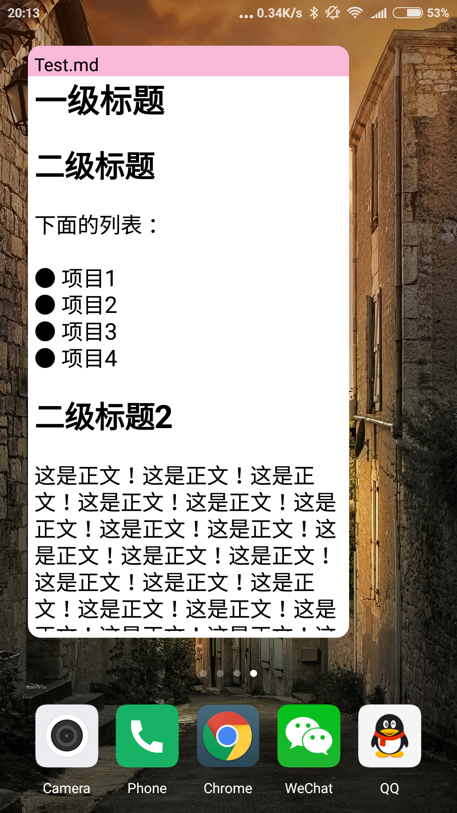
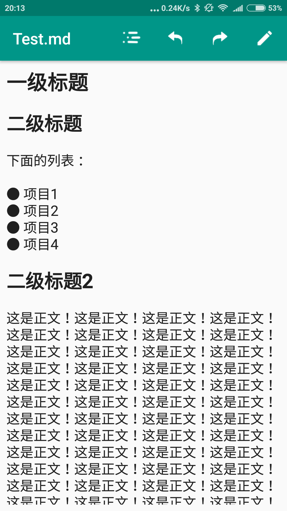
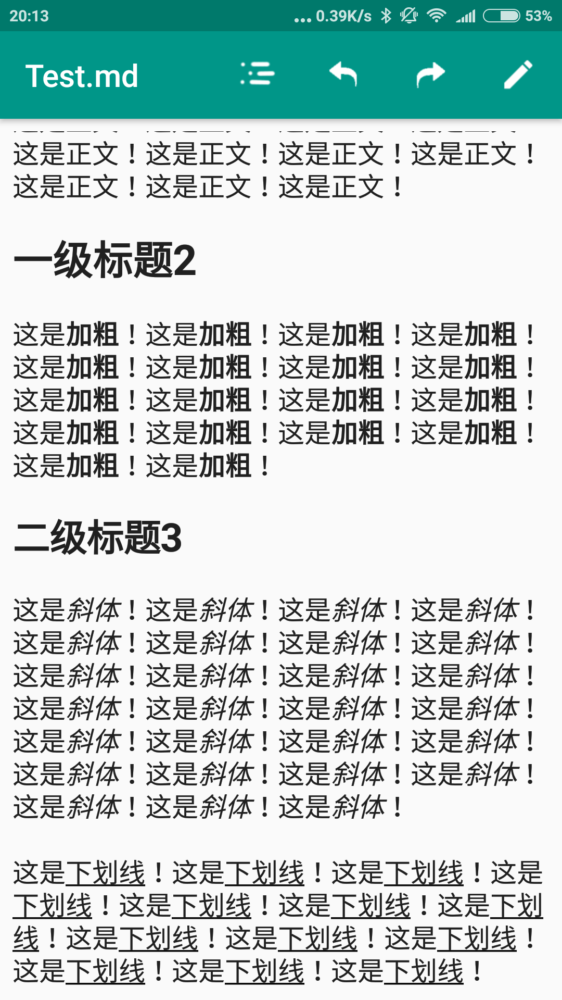
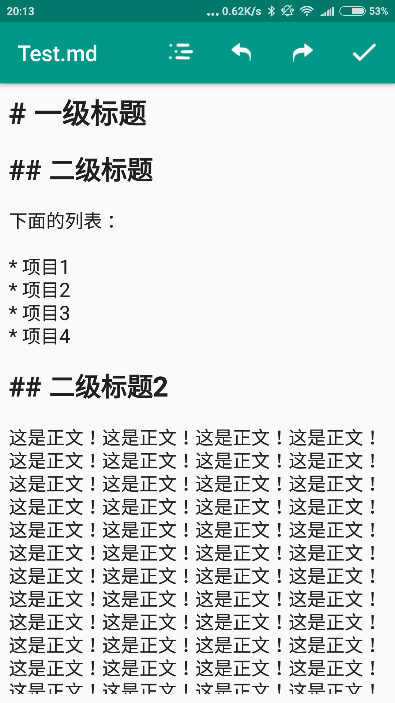
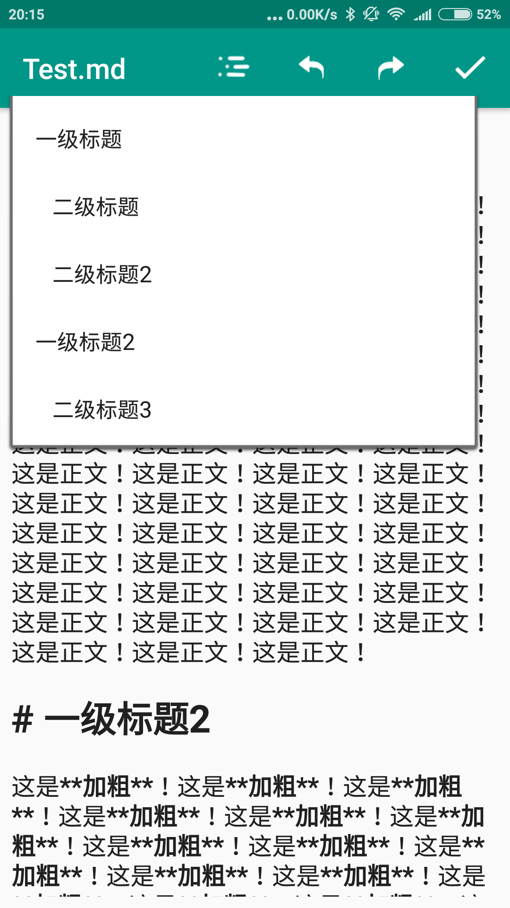

# ChDCTextWidget
一个 TODO 小部件，支持 Markdown。

## 功能

* 以桌面小部件的形式显示文本文件的内容
* 可以关联文本文件的打开方式
* 对 Markdown 部分支持（打开以 `.md` 结尾的文件）

## Markdown 语法支持

* 列表：以 `*` 引导
* 加粗：以 `**` 包括文本
* 斜体 ：以`*` 包括文本
* 下划线：以`__`包括文本（注意：**这与标准 Markdown 语法不同**）
* 标题：以`#` 引导

## 截图

### 桌面小部件效果

### 浏览模式效果

### 编辑模式效果

### 文档结构

## TODO

* Markdown 工具栏：对 Markdown 常用的 `*`、`_`等符号的快捷输入
* 行快捷操作工具栏：快速对一行进行删除、加粗、斜体、下划线等操作
* 列表操作增强：如果上一行是列表项，则按回车键下一行自动变为列表项，再次按回车键则变为正文